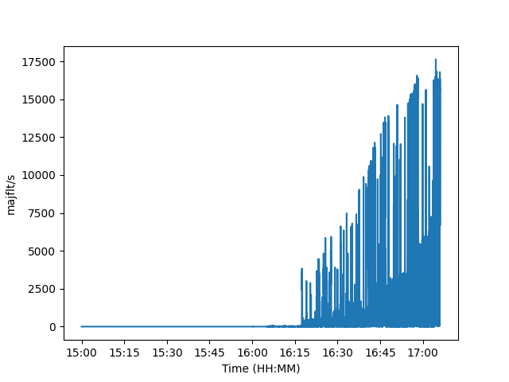

# Innleiing

RAM er mest "scarce" i bruken av microdata-tools ifylgje Daniel Elisenberg.

Det er identifisert tre plassar der den gamle koden OOM-er.
Alle tre plassane kan forbetrast vesentleg.

# Forslag: Streame CSV til parquet

Den gamle koden les heile CSV-fila til minnet for deretter å skriva den til Parquet. Dette er den mest minnekrevjande operasjonen så langt eg kan sjå. Her OOM-er det allereie ved 30M rader og 2GB RAM.

### Effekt
Den nye koden klarar 1164M rader med 0.5 GB RAM før den får OOM.
Det tyder at nye koden har `0.64%` av opprinneleg minnebruk.
Om det er slik at noverande VM-er treng 255 GB RAM for dagens oppgåver,
så burde den nye koden klara det same med `1.6 GB` RAM.


### Ekstra info
Den nye koden OOM-er også ved store datamengder.
Eg trur grunnen til dette er at ParquetWriter-en lyt halda ein viss mengde data
i minnet for å kunne skriva ferdig fila.
Denne begrensninga kjem ein seg ikkje unna.
Eg har ikkje stadfesta denne mistanken.

### Nedside
Ingen.

### Konklusjon
Dette er verdt å gjera dette tiltaket.


# Forslag: Tabell-wide validering med SQLite
Alle fire temporalitetstypar har ein tabell-wide validering:
anten unike identifiers eller sjekk av overlapp for datoar.
Også her får ein OOM.

Henting av identifiers, `identifiers = data.to_table[columns=['unit_id']`, OOM-er ved 90M rader og 2GB ram.

Compute unique av identifiers, `compute.unique(identifiers['unit_id']`, OOM-er ved 75M rader og 2GB ram.

### Effekt
Den nye koden klarar minst 1000M rader med 0.5 GB RAM.
Det tyder at den nye koden har `2.2%` av opprinneleg minnebruk.

### Ekstra info

Eg ser (nesten) ikkje ikkje nokon grunn til at den nye koden nokon gong skal OOM-e.
Unnataket for dette er overlapp-sjekken. Der samlar ein opp alle verdiar med
same `unit_id`. Så dersom det vert veldeg mange med same `unit_id`, så kan
det også truleg OOM-e. Vonleg vert ikkje dette eit problem. Det er truleg
mogleg å løysa dette dersom det skulle verta eit problem.

### Nedside
Ein lyt skriva logikken til/mot SQL i motsetnad til Parquet.
I praksis er dette berre iterering av sorterte rader.
Dette er SQL (rad-orientert) betre på enn Parquet (kollone-orientert).

### Konklusjon
Dette er verdt å gjera dette tiltaket.


## Anna

Eg målte minneevents med `sar -B 1`.
Diagrammet under syner utviklinga i `major page faults / sekund` over tid. 
Dette var for køyringa med 1164+M rader og 0.5 GB RAM. `major page faults` tyder
at minnepages (typisk 4KB eller 8KB) vert skrive til og frå disk, som igjen 
tyder at applikasjonen sliter med å få nok minne.
Det vil gjera at applikasjonen vil gå treigare og treigare di meir frekvent
den må skrive pages til disk.
Og til slutt her sa OS-et nei.
Eg veit ikkje nøyaktig kvifor eller når ei slik grense går.
Uansett var det interessant.




## Utrekningar

### Streame frå CSV til Parquet

```
python3 -c 'old_mem_per_mrow = 2 / 30; new_mem_per_mrow = 0.5 / 1164; print(f"{(100*new_mem_per_mrow) / old_mem_per_mrow:.2f} %")'
=> 0.64 %
```


```
python3 -c 'print(f"{0.0064 * 255:.1f} GB")'
=> 1.6 GB
```

### Tabell-wide validering med SQLite

```
python3 -c 'old_mem_per_mrow = 2 / 90; new_mem_per_mrow = 0.5 / 1000; print(f"{(100*new_mem_per_mrow) / old_mem_per_mrow:.2f} %")'
2.25 %
```

